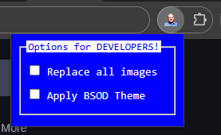

# Steve Ballmer's Chrome Extension

  

DEVELOPERS, DEVELOPERS, DEVELOPERS, DEVELOPERS!

Replace all boring images from any website with funny Steve Ballmer ones!

Looking for a fun way to prank your friends? This extension is perfect for surprising them when they leave their computer unlocked. Transform any website into a hilarious Steve Ballmer-themed experience in seconds!

## Chrome Store

## Features

- Instantly replace all images on any website with hilarious Steve Ballmer pictures.
- Set the [BSOD](https://en.wikipedia.org/wiki/Blue_screen_of_death) theme on any website

## Screenshots

<picture>

 
<label>Replace all images with one click for instant laughs!</label>
</picture>
  

<picture>

 
<label>Set the BSOD theme</label>
</picture>
  

<picture>

 
<label>It works in any website!</label>
</picture>
  

<picture>

 
<label>Easy to enable and disable</label>
</picture>

## More info

- Website: [www.moraisandre.com](https://www.moraisandre.com)
