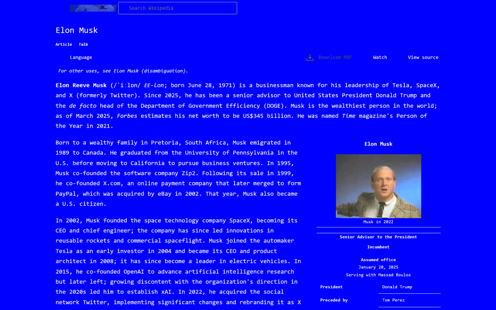

# Steve Ballmer's Chrome Extension

  

DEVELOPERS, DEVELOPERS, DEVELOPERS, DEVELOPERS!
 
Replace all boring images from any website with funny Steve Ballmer ones!

A good extension for pranking your friends when they leave the computer unlocked

## Chrome Store

## Features
- Replace all the images of a WebSite for Steve Ballmer's one
- Set the BSOD theme on any web

## Screenshots
<picture>

 
<label>Simple replace all images</label>
</picture>
  

<picture>

 
<label>Set the BSOD theme</label>
</picture>
  

<picture>

 
<label>Easy to enable and disable</label>
</picture>

## More info
- Website: www.andremorais.com.br
- Twitter: <a href="https://twitter.com/moraisandre">@moraisandre</a>